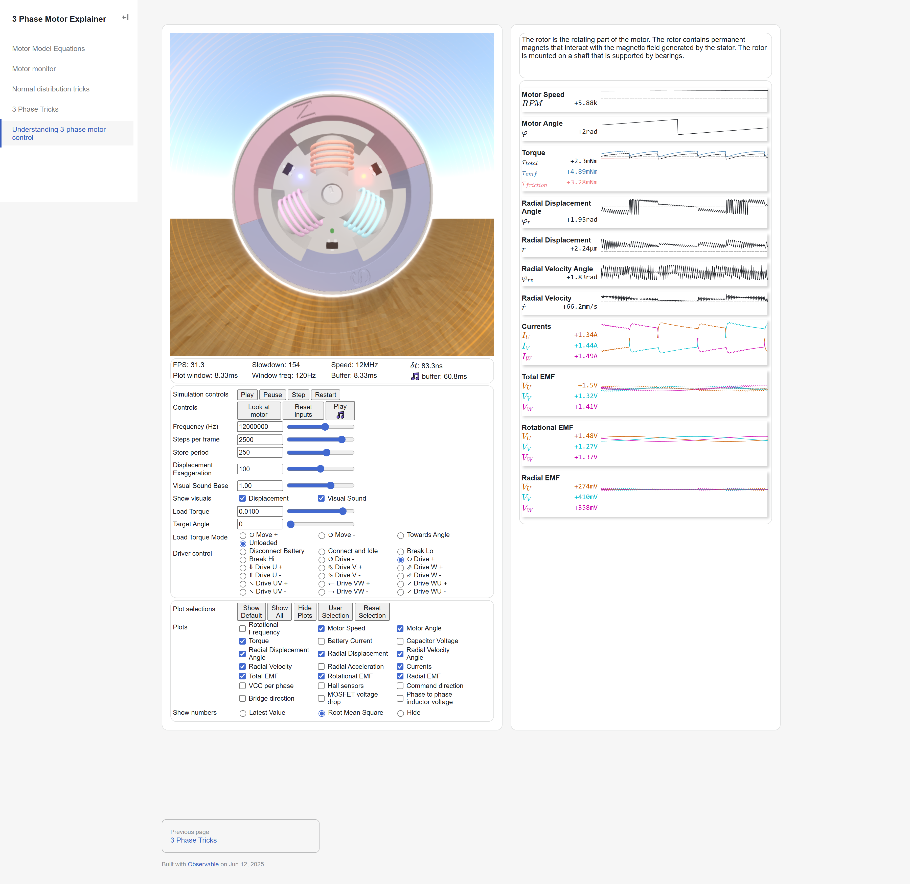

Hex Mini FOC driver
===================

Brushless motor driver for mini gear motors. This driver focuses on fine force control
using field oriented control (FOC). The motor can be commanded to move to track position, 
velocity, and/or force. The driver will maintain the current wave exactly 90 degrees out
of phase to the EMF wave for maximum efficieny. Position is tracked via hall sensors and
EMF feedback.

Maximum recommended limits: 20V, 3A(continuous), 10A(instant).

This project has 4 main components:
* A brushless motor simulator and motor principles explainer; under `motor-sim`.
* The driver PCB schematic and manufacturing files; under `circuits`.
* Custom driver firmware with Kalman filter position tracking and FOC driving logic; under `driver-code`.
* Driver control and monitoring webapp; also under `motor-sim`, the page titled `motor-monitor.md`.

Screenshots
-----------

Motor monitor should look like this when connected to a motor: 

The motor sim, with GPU rendered soundwaves should look like this: 

